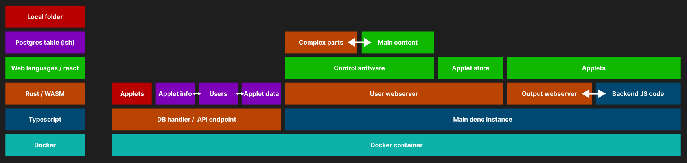

# Computer science NEA     
An app that allows simple design of live stream graphics by providing a suite of backend tools alongside some design tools

## Rough structure plan    

## Ideal feature list
- Basic web hosting 
- Auto triggers certain JS functions when events are triggered 
- A place for custom backend code
- Can easily create control elements on seperate web server (E.g. Send all chat messages there and then user chooses to send them to stream)
- Elements auto join when placed next to each other (Custom CSS trigger + relational multi window stuff on backend)
- Very basic GUI creation elements
- Web store to get elements
- API, OSC and midi triggers
